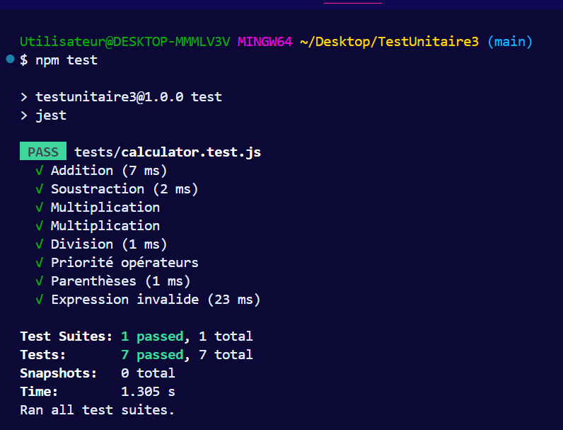

# TestUnitaire3

## PHP Unit via composer


```bash
composer require --dev phpunit/phpunit

```
## Lancement de test avec PHPunit


```bash
./vendor/bin/phpunit tests/CalculatorTest.php

```

## Lancement de test avec Jest



```bash
npm test

```


